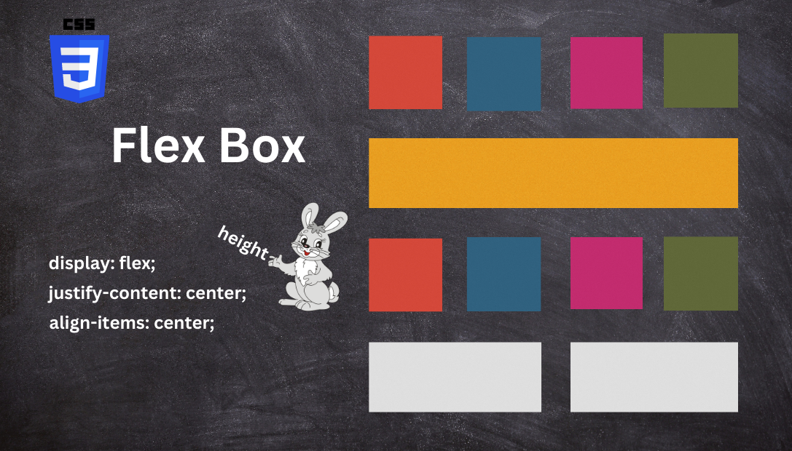
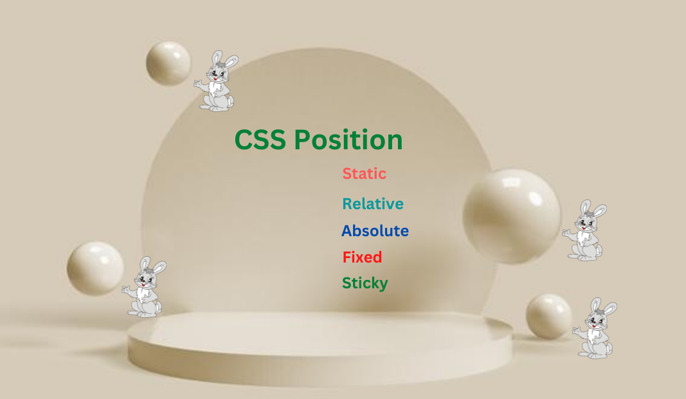

# Hello Everyone,

## Zareel here,

## My articles assignments of full stack javascript web developer bootcamp at iNeuron

## 1. CSS Box Model (Padding, Margin, Border)

[CSS Box Model](https://zareel.hashnode.dev/css-box-model-padding-border-margin)

## 2. Flex Box CSS

[CSS Flexbox](https://zareel.hashnode.dev/css-flexbox)

## 3. Positioning (CSS)

[CSS Positioning](https://zareel.hashnode.dev/css-position-property)

